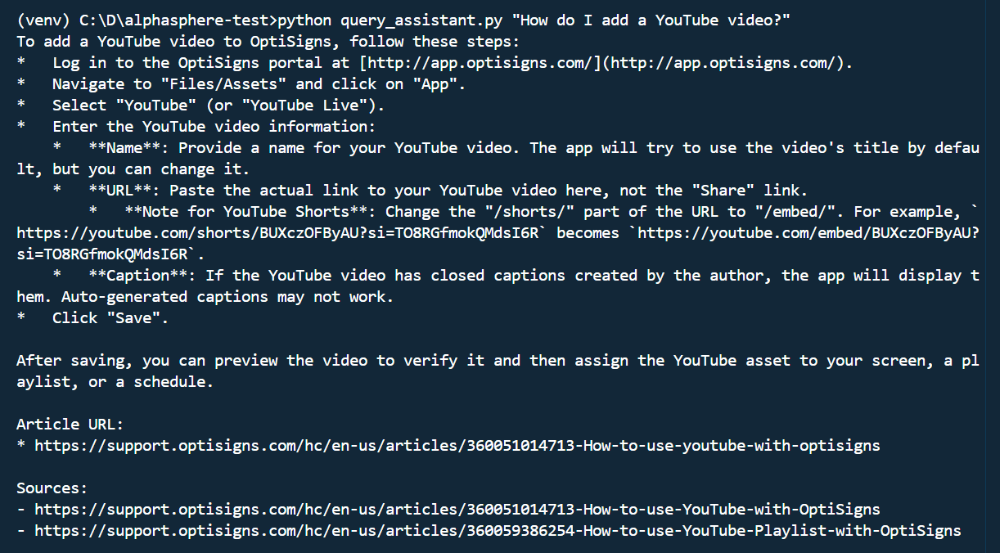

# OptiBot Mini-Clone

This project scrapes OptiSigns support articles from the public Zendesk Help Center API, converts them to Markdown, uploads them to a Google Gemini File Search Store for RAG, and provides a small support chatbot test script (`query_assistant.py`) that answers questions grounded in those docs. It also includes a daily automated sync job that uploads only new or changed articles.

## Architecture

```text
Zendesk API -> Markdown files -> Gemini File Search Store -> query_assistant.py
                                           |
                                           `-> GitHub Actions daily delta sync
```

## Tech stack

- Python 3.x
- `google-genai` SDK using Gemini File Search Tool for RAG
- Zendesk Help Center API, public and unauthenticated
- Docker for packaging
- GitHub Actions for daily scheduling

## Setup

1. Clone the repo.
2. Create a virtual environment and install dependencies:

```bash
python -m venv venv
venv\Scripts\activate
# Mac/Linux: source venv/bin/activate
pip install -r requirements.txt
```

3. Copy `.env.sample` to `.env` and fill in:

```env
GEMINI_API_KEY=<your key from https://aistudio.google.com/apikey>
ZENDESK_SUBDOMAIN=support.optisigns.com
```

## Run locally

```bash
python main.py
```

Optional: set `MAX_ARTICLES_TO_UPLOAD` in `.env` to limit articles for testing.

## Test the assistant

```bash
python query_assistant.py "How do I add a YouTube video?"
```

## Run with Docker

```bash
docker build -t optibot-sync .
docker run -v %cd%/data:/app/data -e GEMINI_API_KEY=... -e ZENDESK_SUBDOMAIN=... optibot-sync
```

Mounting `./data` persists `state.json` across runs for delta detection.

## Delta detection

Each article's content hash is stored in `data/state.json`. On each run, articles are classified as `added`, `updated`, or `skipped` by comparing hashes. Only added or updated articles are uploaded. Updated articles have their old Gemini File Search document deleted first to avoid duplicates.

## Daily automated job

The daily sync runs through `.github/workflows/daily-sync.yml`. It is scheduled once per day and can also be triggered manually with `workflow_dispatch`. It uses `actions/cache` for `data/state.json` and `data/ids.json` because GitHub Actions runners are ephemeral.

Required GitHub Secrets, under `Settings > Secrets and variables > Actions`:

- `GEMINI_API_KEY`
- `ZENDESK_SUBDOMAIN`

View job logs: `https://github.com/pnson1322/alphasphere-test/actions`

## Chunking strategy

Gemini File Search handles chunking and embedding automatically as managed RAG, so no manual chunk size configuration was needed. Each Markdown file includes YAML frontmatter with `title`, `url`, and `article_id`; the article URL is also preserved as `source_url` custom metadata during upload for source citation.

## Known limitations

- 1 out of 404 articles occasionally fails to upload due to a transient Gemini API error: `"Upload has already been terminated"`. The upload call is retried up to 3 times, and failed articles are retried on the next scheduled run because they are not marked complete in `data/state.json`.

## Sample output



Example query: `"How do I add a YouTube video?"` -> correct answer with Article URL citations.
